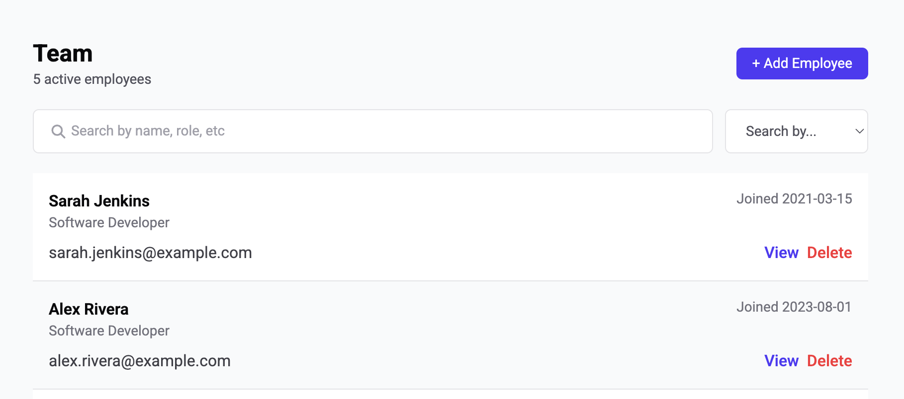
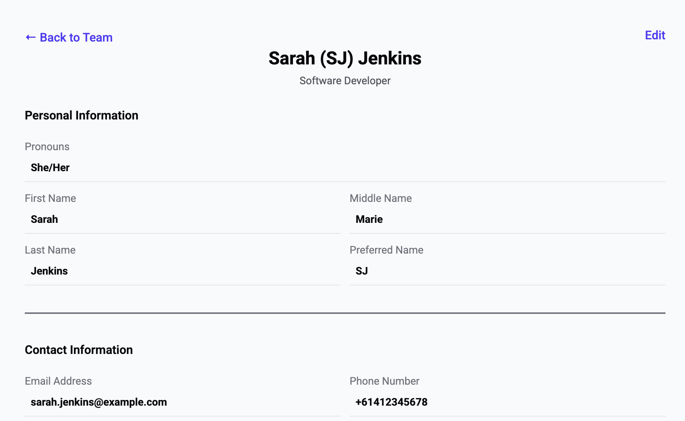
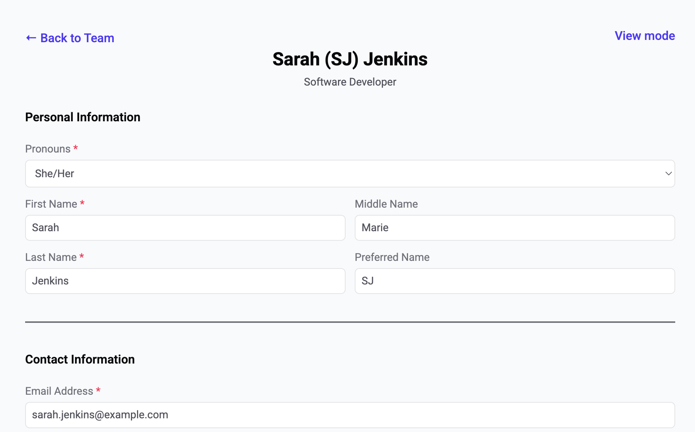

# Full-Stack Employee Application

[](https://github.com/lottieorton/employees/actions/workflows/maven.yml)

**`IN PROGRESS`**

## Demo & Snippets

- **Hosted Link:** TBC
- **App Preview:**

<p align="center">



</p>

---

## Requirements / Purpose

### MVP & Purpose

This application is a full-stack employee management system designed to help users easily oversee employee information. Users can manage employees through full CRUD (Create, Read, Update and Delete) operations.

### Tech Stack

- **Frontend:** React, TypeScript, React Query (TanStack Query), React Hook Form, React Testing Library, React Router, Tailwind.
- **Backend:** Java, Spring Boot, Spring Data JPA, MySQL, OpenAPI/Swagger.
- **Testing & Tools:** Vitest, REST Assured, Maven, Git, GitHub Actions.

**Why this stack?**

- **TypeScript & Java:** Provides strong end-to-end type safety, reducing runtime errors across the stack.
- **Spring Boot:** Offers a robust, scalable backend framework with seamless database integration via JPA.
- **React Query:** Simplifies asynchronous state management by handling cache invalidation and automatic refetching upon database mutations.
- **React Router:** Allows for dynamic routing through single-page apps.

### Database Schema

<p align="center">

</p>

**Key Relational Features:**

- **Normalised Multi-Table Relationships:** Relational mapping linking `employees`, `addresses`, and `roles` through foreign key constraints to ensure data integrity.
- **Self-Referencing Organisational Hierarchy:** The `Employee` entity contains a self-referencing `manager_id` foreign key pointing to another `Employee` record.

---

## Build Steps

### Prerequisites

- Java JDK 17+
- Node.js (v18+) & npm
- MySQL Server running locally

### Backend Setup

1. Navigate to the root directory:

   ```bash
   cd employees
   ```

2. Build and run the Spring Boot application

   ```bash
   mvn spring-boot:run
   ```

3. Once the server is running, access the interactive Swagger API documentation and endpoint testing interface at: [http://localhost:8080/swagger-ui/index.html#/](http://localhost:8080/swagger-ui/index.html#/).

### Frontend Setup

1. Open a new terminal window and navigate to the frontend directory:

   ```bash
   cd frontend
   ```

2. Install dependencies:

   ```bash
   npm install
   ```

3. Run the development server:

   ```bash
   npm run dev
   ```

---

### Environment Variables

To run this application locally, you will need to set up the following environment variables. You can export them in your terminal, define them in your IDE run configuration, or store them in a `.env` file (if using a local environment loader).

| Variable         | Description                  | Example / Default       |
| :--------------- | :--------------------------- | :---------------------- |
| `DB_HOST`        | Database host address        | `localhost`             |
| `DB_PORT`        | Database port number         | `3306` (MySQL)          |
| `DB_USER`        | Database connection username | `root`                  |
| `DB_PASSWORD`    | Database connection password | `your_secure_password`  |
| `DB_NAME`        | Name of the database         | `employee_db`           |
| `SPRING_PROFILE` | Active Spring profile        | `dev` / `prod` / `test` |

### Example `.env` file

```env
DB_HOST=localhost
DB_PORT=3306
DB_USER=root
DB_PASSWORD=secret
DB_NAME=employee_db
SPRING_PROFILE=dev
```

---

## Design Goals / Approach

- **Mobile-First Responsive Design:** Styled to prioritise clean layout and user experience on smaller screens before expanding to desktop views.
- **SPA Navigation:** A multi-page impression implemented through the use of React Router.
- **Clear State Visualisation:** Clear state messaging so users are clear of the status of any requests to the backend.
- **Component-Driven Architecture:** Built small, modular, reusable UI components (e.g. form fields, status banners) to keep page containers clean and readable.
- **RESTful Endpoint Design:** Structured resources (`/employees`, `/addresses`, `/roles`) following REST conventions.
- **Relational Entity Mapping:** Handles multi-table relationships (employees, addresses, and roles) using foreign key constraints for structured data persistence.
- **Dynamic Database Querying:** Utilised Spring Data JPA Specifications to build dynamic database queries on demand.
- **Clear Form Validation:** Designed form with clear indicators for required fields and input validation to reduce volume of incorrect requests made to the backend.
- **Self-Referencing Employee Hierarchy:** Supports organisational hierarchy via a self-referencing manager relationship (`manager_id`), filtering out the current employee from manager selection dropdowns to prevent self-assignment.

---

## Features

- **Employee Management:** Create, view, update, and delete employees. Search for employees through dynamic search options.
- **Address Management:** Create, view, update, and delete addresses. Managed as part of the employee form or deletion process with addresses associated directly with employees.
- **Role Management:** Create, view, update, and delete roles. In the UI, roles are read-only when assigning/viewing a role to an employee.
- **Form Validation:** Form validation is implemented prior to form submission, with clear error messaging to enhance user experience and minimise bad requests to the backend.
- **Dynamic Querying:** Employee searches can be automatically done through a general search (checking against multiple fields in the database) or through specific field searches.
- **Unique Email Generation:** Upon creating an employee, a unique email is generated, preserving the unique constraint placed on the employees table.

---

## Known Issues

- **Optional field overriding:** Currently unable to override an optional field back to a null value once it has been set, though it can be overridden to a different non-null value.

---

## Future Goals

- **Frontend Testing:** Create both unit level and end-to-end testing suites.
- **Backend Logging:** Implement a Log4j configuration to record application activity.
- **Pagination:** Implement pagination functionality across the full stack.
- **Search Filtering:** Implement employee filtering with dropdowns menus on the frontend.
- **Multipage Form:** Update the employee form to be spread over multiple pages.
- **Manager/Subordinate Linking:** Add links between managers and their direct reports on the employee details page.
- **Soft Delete:** Implement a soft-delete feature so inactive employees are filtered out by default, while remaining accessible via an explicit filter.

---

## Change Logs

**19/08/2026:** Initial project set up

- Created Spring Boot application
- Base React Header components Created

**20/08/2026:** Front-end mobile styling

- Implemented main frontend components with mobile-focussed styling

**21/08/2026:** Roles and addresses endpoints and backend configuration

- Configured database connection, error handling and model mapper
- Implemented roles CRUD endpoints
- Implemented addresses CRUD endpoints

**22/08/2026:** Employee endpoints

- Implemented employee endpoints

**24/08/2026:** Backend Testing

- Implemented service tests and end-to-end tests across roles, addresses, employees

**25/08/2026:** Dynamic Query Searches, routing and responsive fields

- Implemented dynamic query searching for employees through Specifications
- Added application license
- Configured CI/CD pipeline for backend
- Implemented React Router
- Added responsive styling
- Form field components for the different field types

**26/08/2026:** Homepage and employee page base setup

- Base homepage, employee page (details and form) setup
- Configured connection from backend to frontend
- Consumed getAllEmployees endpoint with query search
- Implemented employees fetching error handling
- Updated employee form and added base validation

**27/08/2026:** Consumed additional endpoints for the employee page and form

- Consumed getEmployeeById, getAllRoles, and createEmployee (with default address id) endpoints
- Applied styling to employee details page
- Created and consumed enum endpoint for form selections

**28/08/2026:** Consumed update and delete endpoints

- Updated implementation of create employee page
- Consumed update and delete employee endpoints
- Consumed update and delete address endpoints

**31/08/2026:** State handling and specific field searches

- Implemented complete error and loading state handling
- Implemented specific field search bar functionality
- Refactored employee form and styling

**02/09/26:** React Component testing

- Added Vitest configuration
- Implemented many React unit testing suites for components

**03/09/2026:** React Unit Testing Contnued

- Implemented the remaining React unit testing suites

---

## What did you struggle with?

- **Employee Testing:** Time consuming and refactoring needed when testing this complex endpoint with query logic and dependencies.
- **Implementing Form Validation:** Difficulty handling the various types of field authentications through zod.

---

## Further details, related projects, reimplementations

- **Backend API:** Spring Boot REST API serving endpoints at `/employees`, `/addresses` and `/roles`.
- **Frontend Application: IN PROGRESS** React single-page application consuming the Spring Boot REST endpoints.
