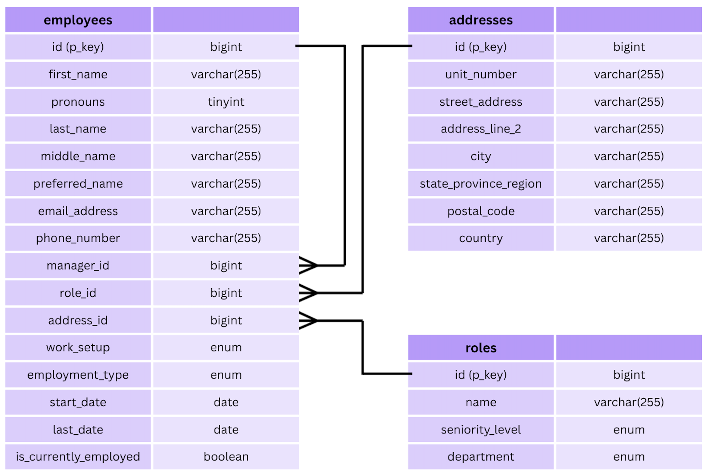

# Full-Stack Employee Application

**`IN PROGRESS`**

## Demo & Snippets

- **Hosted Link:** TBC
- **App Preview:** TBC

<p align="center">

</p>

---

## Requirements / Purpose

### MVP & Purpose

This application will be a full-stack employee management system designed to help users easily oversee employee information. Users can manage employees through full CRUD (Create, Read, Update and Delete) operations.

### Tech Stack

- **Frontend:** React, TypeScript, React Query (TanStack Query), React Hook Form, React Testing Library, React Router, Tailwind.
- **Backend:** Java, Spring Boot, Spring Data JPA, mySQL, OpenAPI/Swagger.
- **Testing & Tools:** Vitest, REST Assured, Maven, Git, GitHub Actions.

**Why this stack?**

- **TypeScript & Java:** Provides strong end-to-end type safety, reducing runtime errors across the stack.
- **Spring Boot:** Offers a robust, scalable backend framework with seamless database integration via JPA.
- **React Query:** Simplifies asynchronous state management by handling cache invalidation and automatic refetching upon database mutations.
- **React Router:** Allows for dynamic routing through single-page apps.

### Database Schema



---

## Build Steps

### Prerequisites

- Java JDK 17+
- Node.js (v18+) & npm
- MySQL Server running locally

### Backend Setup

1. Navigate to the root directory:

   ```bash
   cd employees
   ```

2. Build and run the Spring Boot application

   ```bash
   mvn spring-boot:run
   ```

3. Once the server is running, access the interactive Swagger API documentation and endpoint testing interface at: http://localhost:8080/swagger-ui/index.html#/

### Frontend Setup

1. Open a new terminal window and navigate to the frontend directory:

   ```bash
   cd frontend
   ```

2. Install dependencies:

   ```bash
   npm install
   ```

3. Run the development server:

   ```bash
   npm run dev
   ```

---

### Environment Variables

To run this application locally, you will need to set up the following environment variables. You can export them in your terminal, define them in your IDE run configuration, or store them in a `.env` file (if using a local environment loader).

| Variable         | Description                  | Example / Default       |
| :--------------- | :--------------------------- | :---------------------- |
| `DB_HOST`        | Database host address        | `localhost`             |
| `DB_PORT`        | Database port number         | `3306` (MySQL)          |
| `DB_USER`        | Database connection username | `root`                  |
| `DB_PASSWORD`    | Database connection password | `your_secure_password`  |
| `DB_NAME`        | Name of the database         | `employee_db`           |
| `SPRING_PROFILE` | Active Spring profile        | `dev` / `prod` / `test` |

### Example `.env` file

```env
DB_HOST=localhost
DB_PORT=3306
DB_USER=root
DB_PASSWORD=secret
DB_NAME=employee_db
SPRING_PROFILE=dev
```

---

## Design Goals / Approach

- **Mobile-First Responsive Design:** Styled to prioritise clean layout and user experience on smaller screens before expanding to desktop views.

---

## Features

- **Employee Management:** To be implemented on frontend. Create, view, update, and delete employees. Search for employees through dynamic search options.
- **Address Management:** Backend API endpoints only: Create, view, update, and delete addresses, to be associated with employees.
- **Role Management:** Backend API endpoints only: Create, view, update, and delete roles, to be associated with employees.

---

## Known Issues

---

## Future Goals

- **Frontend responsive styling:** Complete desktop layout breakpoints and polish animations.
- **Frontend logic configuration:** Connect forms to React Query mutations and test end-to-end user flows.

---

## Change Logs

**19/08/2026:** Initial project set up

- Created Spring Boot application
- Base React Header Components Created

**20/08/2026:** Front-end mobile styling

- Implemented main frontend components with mobile focussed styling

**21/08/2026:** Roles and addresses endpoints and backend configuration

- Configured database connection, error handling and model mapper
- Implemented roles CRUD endpoints
- Implemented addresses CRUD endpoints

**22/08/2026:** Employee endpoints

- Implemented employee endpoints

**24/08/2026:** Backend Testing

- Implemented service tests and end to end tests across roles, addresses, employees

**25/08/2026:** Dynamic Query Searches

- Implemented dynamic query searching for employees through Specifications

---

## What did you struggle with?

- **Employee Testing:** Time consuming and refactoring needed when testing this complex endpoitn with query logic and dependencies.

---

## Further details, related projects, reimplementations

- **Backend API:** Spring Boot REST API serving endpoints at `/employees`, `/addresses` and `/roles`.
- **Frontend Application: IN PROGRESS** React single-page application consuming the Spring Boot REST endpoints.
